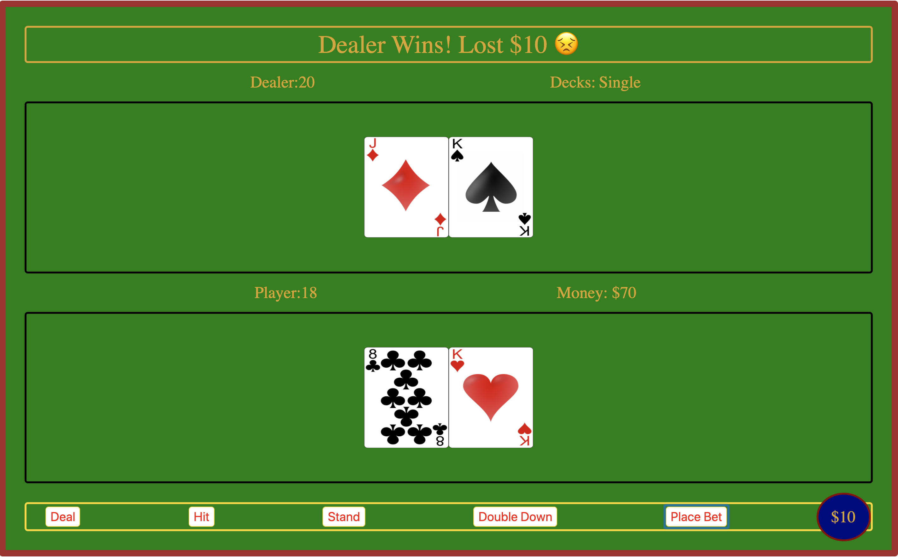

# Blackjack

## Contents
- [What It Is](#What-It-Is)
- [What I Used](#What-I-Used)
- [Challenges and Solutions](#Challenges-and-Solutions)
- [Minimum Viable Product](#Minimum-Viable-Product)
- [Stretch Goals](#Stretch-Goals)
- [Screenshots](#Screenshots)
- [Code Examples](#Code-Examples)
## What It Is
A blackjack app built with vanilla JavaScript and emphasizing fundamentals of functional programming to implement features
using clean, reusable code.  

This project taught me the importance of refactoring code and the value of using well-written functions in JavaScript. As the project became more complex and I added more functionality, the code became more difficult to read and write without using clear functions and properly-named variables. Features I added include the ability to bet, double-down, and select the amount of decks and money to play the game with.
## What I Used
- HTML
- CSS
- JavaScript
## Challenges and Solutions
## Minimum Viable Product
## Stretch Goals
## Screenshots
## Code Examples
